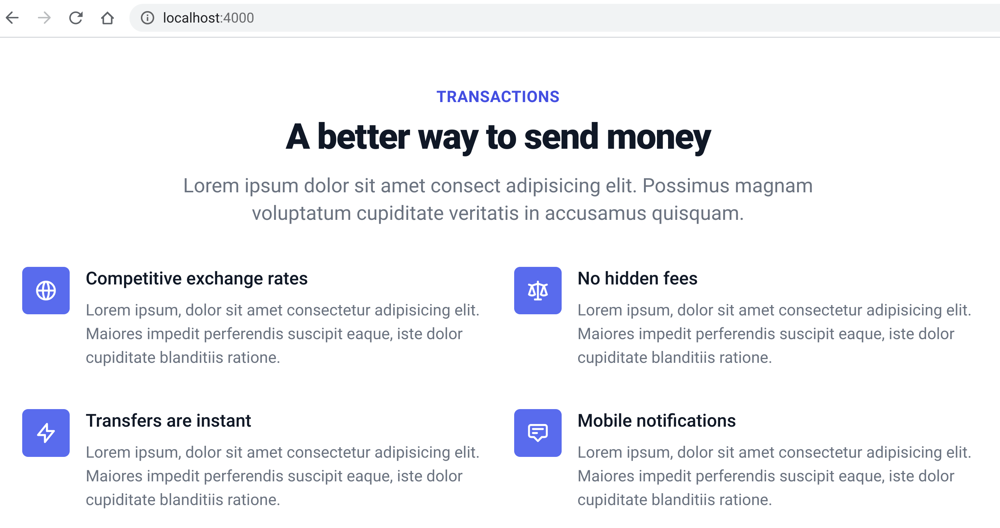

# Example Phoenix 1.5 and Tailwind 2.0 App

This shows a plain [Phoenix](https://www.phoenixframework.org/) app, generated
with `mix phx.new my_app`, and adding [Tailwind](https://tailwindcss.com/) to
it.

[See the commit that made it
work](https://github.com/dbernheisel/phoenix15-tailwindcss2/commit/4d2853aef2a8822d15191bd3be4acc52285a32ef).

Verified this works with both `node-sass` and `sass`.

